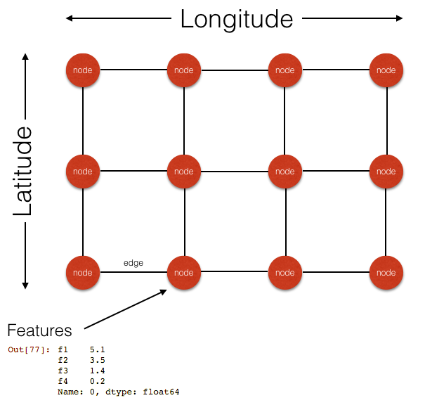
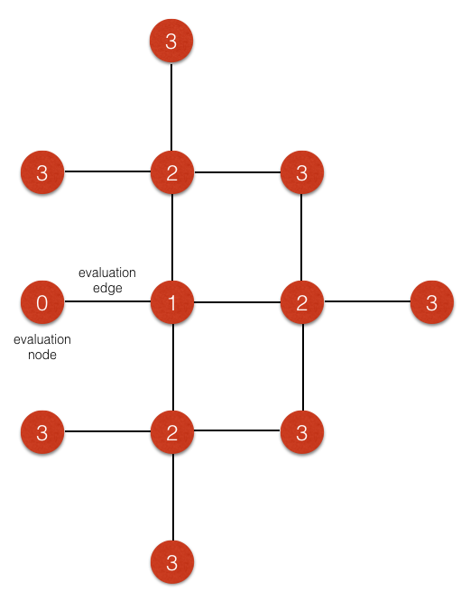
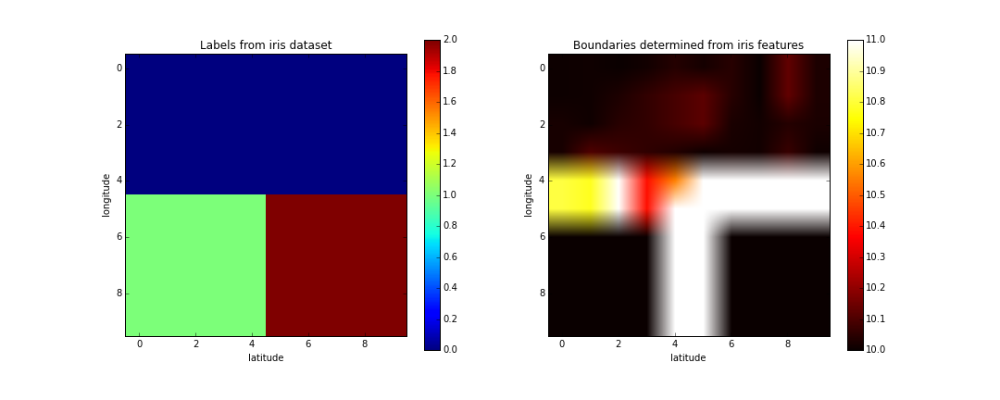

# Neighborhood identification and similarity

Chris Rupley

November 2, 2015

## Project Summary

Getting to understand the character of a city's neighborhoods can be difficult and recognizing where one neighborhood ends and another begins is not easy either, especially considering that character can be continually evolving. I am proposing a tool to visualize functional neighborhoods in a city based on clusters of similar characteristics, not politically drawn boundaries.

The character of a neighborhood can be captured using an array of available data sources such as demographics, business types, property values, and transit. The boundaries of what we think of as 'neighborhoods', clusters of similar areas within a city, can even change based on what metrics we are evaluating. Do you want a place with low crime, good schools, and easy access to transit? Or would you like a selection of good restaurants, boutique shops, and plenty of parks? These metrics will slice up a city in different ways.

Once you have determined what metrics you are interested in, you can then find other areas of the city that are similar to the ones you are familiar with. Or you could even assess neighborhoods in another city you have never visited if you are planning a visit or perhaps relocating there.

Finding similar neighborhoods could be useful to individuals looking to discover new places to vist, to businesses trying to reach their target customer, and to municipal governments for planning infrastructure and services.

## Data

So far, I have gathered the following data for use in clustering:

Dataset | Source | Information | Resolution
:--|:--|:--|:--
Crime | SF Open Data | Crime incidents: type, location | point
Registered Business | SF Open Data | Business type (restaurant, market, etc.), location | point
Property Assessments | SF Open Data | County tax assessment of properties by address | point
Various demographics | US Census | population density, income, household size, age, gender | block (7400 data points in SF)
Walkscore | walkscore.com | "walkability" of an area | 500 ft. (5000 data points in SF)

* "Point" resolution means that each datapoint is tied to a specific latitude/longitude or street address. An address to lat/lon lookup is available via the US Census through Geocoder (1000 conversions per request) or the full address database (US TIGER/line).

## Method

In order to determine geographical clusters of similar neighborhoods. I plan to use a graph-based approach. First, the data will be aggregated into latitude/longitude bins; summing or averaging where appropriate. These bins can be of arbitrary size and will determine the resolution of the final result. If I choose square bins 500 ft. per side, this will yield a grid of 70 x 70 bins across the city of San Francisco for a total of 4900 bins.

The bins will then be laid out as nodes in an interconnected graph as illustrated below,

Each node will be tied to a lat/lon point and will be linked to a feature matrix representing whatever data is chosen for clustering.

By chosing to use geographically equally spaced bins (instead of linking the bins to, for example, US census blocks), I am able to simplify these calculations since I know every edge in the graph has the same length.

Using this graph model, I can now begin to find boundaries of the neighborhood clusters. For each node, I want to assess the distance between its features and those of the connected nodes. This can be done using a distance metric such as Euclidean or cosine distance. In the simplest case, I can assign each edge a distance score based on the two connecting nodes. However, cleaner results can be obtained by looking deeper into the graph. Rather than just look at adjacent nodes, the edge can be scored based on all of the nodes several levels removed from the main node. This is illustrated in the following diagram,

Showing nodes up to 3 levels away from evaluation node.

Once a distance score is calculated for each edge in the graph, I can start to cut the edges with the highest score (those separating parts of the graph with the largest distance). Eventually some clusters will start to emerge.

One problem with this approach is that this is not guaranteed to produce isolated clusters (e.g. there may be some thin 'bridge' that connects two rather dissimilar clusters). To account for this, once some boundaries have been roughly established using the distance metric, edges can continue to be removed based instead on their connectedness until large clusters are isolated.

### Proof of concept

I attempted a small-scale trial of this algorithm using the iris dataset (Fischer, 1936). I distributed the 3 iris species into a 10 x 10 grid of nodes, geographically clustered by species. I then calculated the distance metric for each edge of the graph just going 1 level deep (i.e. distance between the connected nodes only). The results are pictured in the following diagram.

The left plot shows the geographical arrangement of iris species and the right plot shows edge distances. We can clearly see the edges between dissimilar species has been detected by the model and, in this case, if we cut edges in order of highest distances, it appears we will eventually arrive at 3 distinct clusters.

### Model tuning

There are many parameters that will need to be tuned in this model. I see the most important to be as follows,

* geographical bin size
* which features to include
* feature scaling and normalization
* search depth in calculating edge distance
* when to stop removing edges / when to switch from cutting by distance to cutting by connectedness
* type of distance metric to use (Euclidean, cosine, ...)

## Project Plan

The sequence of events and estimated times for project completion is as follows.

* Data collection (before project start)
	* import all required data into a single database with a consistent, usable format
* Model generation (about 1 week)
	* write required functions to build and visualize model
* Model tuning (about 1 week)
	* vary model parameters to determine optimal output
* Visualization (2 day)
	* develop plots of results, overlay on maps
* Interpretation (1 day)
	* analyze results to find interesting connections

